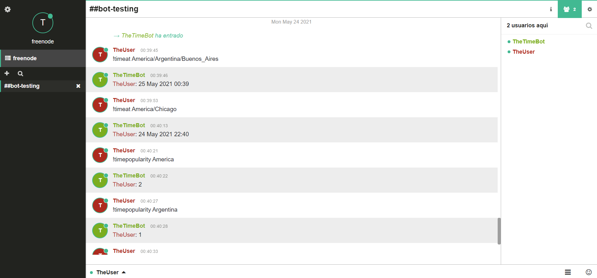

# 🤖 irc-time-bot ⌚

An IRC Timebot for Freenode 🌿

## Description

This project consists of a basic NodeJS prototype for the backend portions of a chatbot that could be called form an [IRC](https://en.wikipedia.org/wiki/Internet_Relay_Chat) channel.
For the time being, it only manages these two commands:

- `!timeat <tzinfo>`: That returns time in the specified timezone.
- `!timepopularity <tzinfo_or_prefix>`: That returns the ammount of valid `!timeat` requests that have been received for timezones that start with `<tzinfo_or_prefix>`. A “prefix” is defined as any characters before a `/` in a `tzinfo` string.

To persist popularity data across restarts of the bot application, a simple JSON file is maintained through the app.

In addition, it can be integrated into an actual [Freenode](https://freenode.net/) IRC server.

Finally, the project is bundled into a simple reusable [NPM package](#📦-Using-the-bot-as-an-NPM-package) to invoke the bot.

## 🌅 Getting Started

### 🔧 Prerequisites

- [NodeJS](https://nodejs.org/en/)
- [NPM](https://www.npmjs.com/)
- [Visual Studio Code](https://code.visualstudio.com/)
- So far, this has been only tested on Windows 10.

### 👨‍💻 Installing

To get started with the source code, please run the following steps:

1. Clone repository from GitHub:

   - Open your terminal and move to your desired folder to contain the project, then execute:

     `$ git clone https://github.com/MarianoAIglesias1994/irc-time-bot.git`

2. Move into the folder: `$ cd irc-time-bot/`
3. Run npm install: `$ npm install`

### 🏃‍♂️ Executing

Once you have the previous configuration, you can head into these steps:

1. Make sure you have an `.env` file at project root level, with a content like the following example:

```
## IRC SERVER CONFIG
# IRC Server
IRC_SERVER='chat.freenode.net'
# IRC Server port
IRC_PORT=6667
# Show debug messages
IRC_DEBUG=true
# Secure config
IRC_SECURE=true
# IRC channel name
IRC_CHANNEL=##bot-testing
# Bot nickname
IRC_BOTNICK=TheTimeBot

# TIME API
TIME_API='http://worldtimeapi.org/api/'
TIME_API_ENDPOINT='timezone/'

# STORAGE
STORAGE_FILE='/storage.json'

```

It contains the different configurations for the bot: IRC server, Time API & Storage. This environment file is ignored by Git, but does not contain any secret so far.

2. Verify that there is a `storage.json` file under `src/storage`, with at least an empty array `[]`. Here, we will be storing all the requests to the bot, thus, if there's any content you might delete it while erasing this file (❗).

3. You are ready to execute the bot, run: `$ npm run start` and it will be up and running in a few seconds.

4. You can connect to the IRC channel you defined in the `.env` file at this web:

   - [https://webchat.freenode.net/](https://webchat.freenode.net/)

   Please, use a different user name from the bot nickname.

5. You can start writing messages and monitor them arriving on the bot console, as well as watch how the bot reponds when a certain command is sent. For instance, try out the following commands:

   - `!timeat America/Argentina/Buenos_Aires`
   - `!timeat America/Chicago`
   - `!timepopularity America`
   - `!timepopularity Argentina`
   - `!timeat Europe/Berlin`
   - `!timeat Europe`

   

   You can see that the bot tags the user who issued the command. This is done in order to keep track of who invoked the command in a chatroom with multiple users.

- Particular cases:
  - When the `<tzinfo>` of a `!timeat` command doesn't match a **full timezone**, then the bot answers: `<username>: Unknown timezone`. This can happen with wrong timezones (v.g., `Nowhere`), or with timezones not specific enough (like `America/Indiana` or `Europe`).
  - When `!timeat Vancouver` is invoked, then the bot responds with the time from `America/Vancouver` instead of `unknown timezone`.

### 📦 Using the bot as an NPM package

This project has been bundled into a simple reusable NPM package to invoke the bot. You may use it by executing `$ npm install irc-time-bot` and then you can include in your project like this:

```javascript
const bot = require("irc-time-bot");

bot.start();
```

Remember to include the `.env` file at project root level. This time, the app data will be stored under the `node_modules/irc-time-bot/src/storage/` folder.

### 🏭 Architecture

The app is quite simple, and consists of the following elements:

- The _bot manager_: that connects to the IRC server, given the configuration, and passes the message parser as the callback for each incoming message.
- The _message parser_: that filters out the messages only considering those being commands, and invoking the command handler in turn.
- The _command hanlder_: that detects the corresponding command being issued.

  - In the `!timeat` command, the strategy is to call the Time API, and if it's successful, parse the response from `ISO 8601` format to the `DD MMM YYYY HH:mm` format and send the answer to the IRC channel. It also accounts the request in the JSON file, implementing a recursive tree structure.

    - In case of any problems with the API, an according response will be sent:

      - _HTTP Error 404_: `<username>: Unknown timezone.`
      - _HTTP Error 503_: `<username>: Time service unavailable, please try again.`

        - An special retry policy has been implemented to mitigate these errors.

      - _Every other error_: `<username>: Unknown error, please try again.`

  - In the `!timepopularity` command, the methodology is to retrieve the account for the particular timezone or prefix from the JSON file in the storage, and then send it back to the command handler and to the IRC channel afterwards.

## 🆘 Help

In case of any issue don't hesitate to [contact me](mailto:miglesias@fi.uba.ar).

## ✍ Author

- [Mariano Iglesias](https://github.com/MarianoAIglesias1994)

## 📜 Version History

- 1.0.0
  - Initial Release
